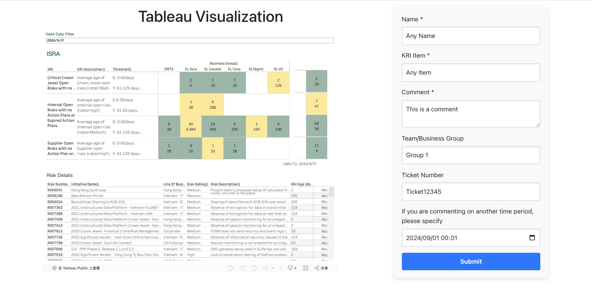
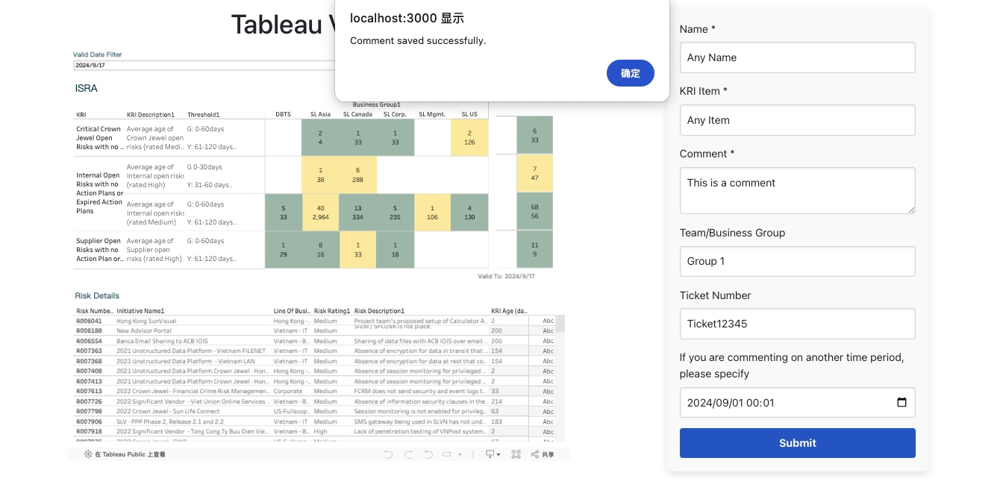
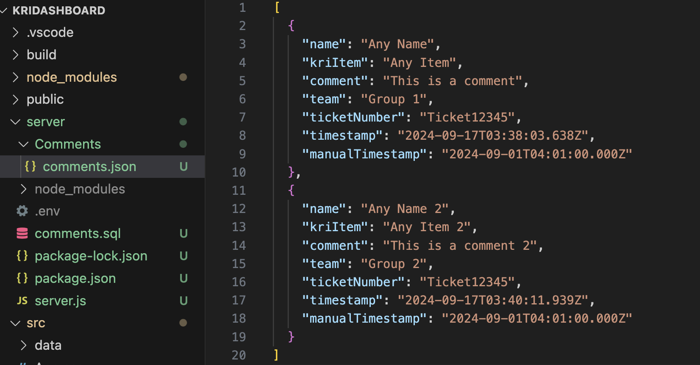

# Getting Started with Create React App

This project was bootstrapped with [Create React App](https://github.com/facebook/create-react-app).

### Set up the project

In the root directory, run `npm i`
In the server directory, run `npm i`

### Run the Frontend:

go to the src folder and run `npm start`
Open [http://localhost:3000](http://localhost:3000) to view it in your browser.

### Run the Backend:

go to the server folder and run `node server.js` on a separate terminal. The server is running on `http://localhost:3001`

### How to add comments

As shown below, the user may enter the data in the right commenting section, and then submit.

It will then show a pop up, stating the comment has been saved successfully.

The comments are saved in `server/Comments/comments.json`. When adding a new comment, it will be added to the same file. If user wish to clear the entire data, please remove the `Comments` folder. This will avoid errors when adding new comments.

### Notes:

When adding manual timestamp, please refer to the current time zone. It will then automatically converted and be recorded in UTC timezone. Both `"timestamp"` and `"manualTimestamp"` are recoded in UTC time.

When changing Tableau Display, Please change the corresponding data in `/src/TableauViz.jsx`.
